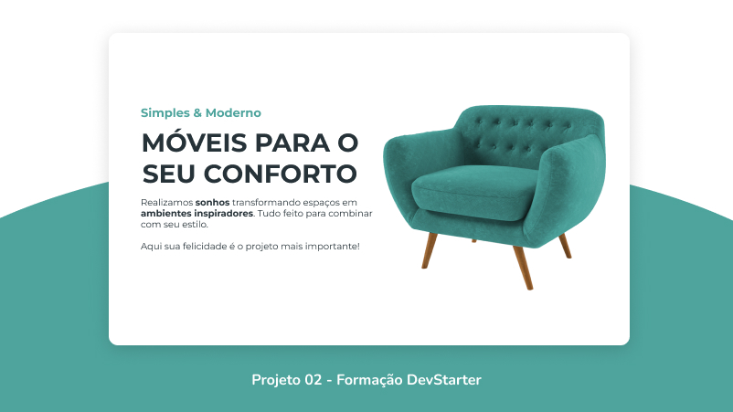

<h1 align="center"> DevStarter Projeto #01 </h1>

Primeiro projeto criado na formação DevStarter no módulo de introdução ao HTML e CSS

  <a href="#-tecnologias">Tecnologias</a>&nbsp;&nbsp;&nbsp;|&nbsp;&nbsp;&nbsp;
  <a href="#-projeto">Projeto</a>&nbsp;&nbsp;&nbsp;|&nbsp;&nbsp;&nbsp;
  <a href="#-layout">Layout</a>&nbsp;&nbsp;&nbsp;|&nbsp;&nbsp;&nbsp;
  <a href="#memo-licença">Licença</a>

  

 

  

## 🚀 Tecnologias

Esse projeto foi desenvolvido utilizando as seguintes tecnologias:

- HTML
- CSS

## 💻 Projeto

Este projeto tem o objetivo de ensinar e ajudar os alunos da Formação DevStarter a fixar os conhecimentos básicos de HTML e CSS e aprender os conceitos de Box Model e Flexbox do CSS.

## 🎨 Layout

Você pode visualizar o layout do projeto [aqui](https://www.figma.com/file/Gsm54rqa9SZ69sfaRqDVH4/%5BDevStarter%5D-Projeto-2-(Community)?node-id=0-1&t=dseDRSvVxZJayB1q-0). Para acessá-lo é necessário ter conta no [Figma](https://figma.com).

## :memo: Licença

Esse projeto está sob a licença MIT.

---

Feito com ♥ by Gilberto Bueno :wave:
